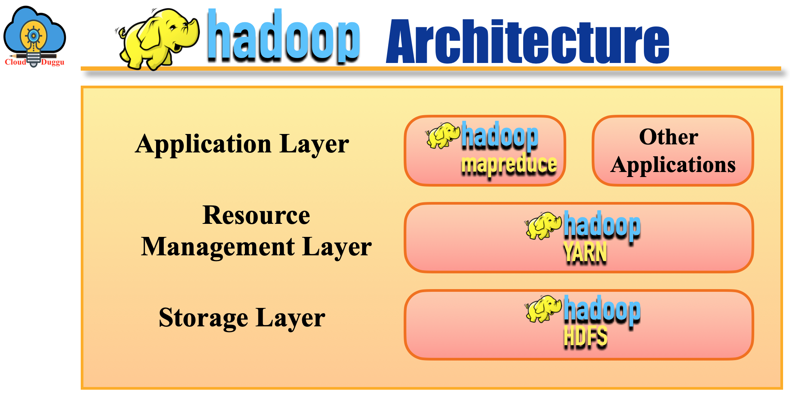
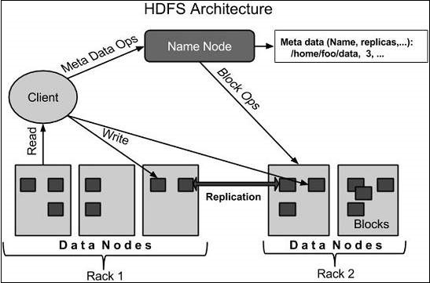
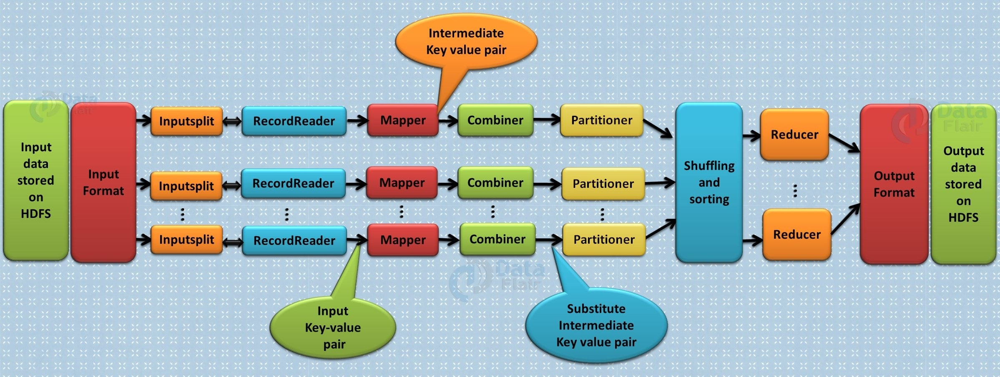
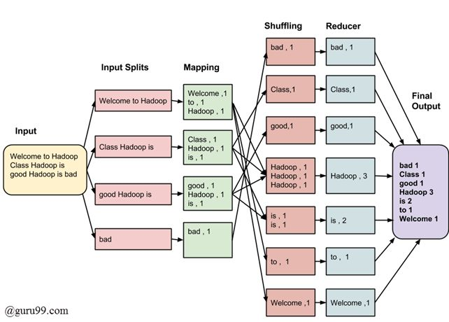

# My Learning Journey Towards Hadoop
As a Data Science student, I am excited to dive into the world of Big Data Engineering, which is a critical part of my curriculum in Semester 6. I have decided to start my learning journey with Hadoop, followed by Kafka, Spark or PySpark, I am planning learning path starting with Hadoop and progressing through related technologies.

Here’s a detailed overview of each technology, including their architectures and key concepts.
## 1. Hadoop
Hadoop is an open-source framework designed for distributed storage and processing of large datasets using the MapReduce programming model. 
It comprises several key components:
Hadoop Architecture:

## Learning Of HDFS
## Hadoop Distributed File System (HDFS)
HDFS is designed to store large datasets across multiple machines. It follows a master-slave architecture with a NameNode (master) that manages metadata and DataNodes (slaves) that store the actual data.
HDFS Architecture:

### Components of HDFS
Hadoop Distributed File System (HDFS) is designed to store and manage large datasets across multiple machines. 
Here are its main components:
1. NameNode
- Definition: The NameNode is the master server that manages the file system namespace and regulates access to files.
- Role: It maintains metadata about the files and directories, such as file names, permissions, and the locations of data blocks. It does not store the data itself but the metadata.

2. DataNodes
- Definition: DataNodes are the worker nodes that store the actual data in the HDFS.
- Role: They manage storage attached to the nodes and serve read/write requests from clients. DataNodes are responsible for block creation, deletion, and replication based on the instructions from the NameNode.

3. Replication
- Definition: HDFS replicates each block of data across multiple DataNodes.
- Role: Replication ensures data reliability and availability, with the default replication factor typically being three. This redundancy protects against data loss due to node failures.

4. Metadata Operations
- Definition: Metadata operations involve managing the file system's structure and its metadata.
- Role: The NameNode handles these operations, including maintaining file hierarchy, access permissions, and information about data block locations.

## Learning Of MapReduce Actually
## MapReduce: 
MapReduce is a programming model for processing large datasets in parallel across a Hadoop cluster. 
It consists of two main functions: the Map function processes and filters data, while the Reduce function aggregates the results.

MapReduce Architecture:

### Components of MapReduce
MapReduce is a core component of Hadoop for processing large data sets with a distributed algorithm on a cluster. 
Here are the primary components of MapReduce:

1. InputSplit
- Definition: InputSplit is a logical representation of the chunk of data that each Mapper processes.
- Role: It splits the input data into manageable chunks for parallel processing by multiple Mappers.

2. RecordReader
- Definition: RecordReader is responsible for reading the raw data from the InputSplit and converting it into key-value pairs.
- Role: It parses the input into records that are understandable by the Mapper, typically converting lines of text into key-value pairs.

3. Mapper
- Definition: The Mapper processes each input record and produces intermediate key-value pairs.
- Role: It transforms and filters the input data into a form that can be reduced, generating intermediate data for the next phase.

4. Combiner
- Definition: The Combiner is an optional component that performs local aggregation of intermediate data to minimize the volume of data transferred to the Reducers.
- Role: It acts as a mini-reducer, combining intermediate data on the Mapper side to optimize the performance of the MapReduce job.

5. Partitioner
- Definition: The Partitioner determines which Reducer will process each key-value pair based on the key.
- Role: It ensures that all the values for a given key are sent to the same Reducer, which is crucial for correct data aggregation.

6. Shuffling and Sorting
- Definition: This phase involves transferring data from Mappers to Reducers (shuffling) and sorting the intermediate data by key.
- Role: It groups all the values for each key together, preparing the data for the reduction phase.

7. Reducer
- Definition: The Reducer processes the sorted key-value pairs from the shuffling and sorting phase and produces the final output.
- Role: It aggregates and reduces the intermediate data into the final output, performing operations like summing, averaging, or other forms of aggregation.

## Example

## Learning Of YARN
YARN (Yet Another Resource Negotiator): YARN is the resource management layer of Hadoop. It manages and schedules resources for running applications.

### Example Scenario without Code ###
Imagine a scenario where we have a large dataset containing user logs from a website. We want to analyze this data to count the number of times each user visits the site. Here's how MapReduce and HDFS components would work together:

**Data Ingestion**
- HDFS: The raw log data is stored in HDFS, distributed across multiple DataNodes.
- NameNode: Keeps metadata about the file locations and structure.

**Processing with MapReduce**
- InputSplit: The large log file is divided into smaller InputSplits.
- RecordReader: Reads each InputSplit and converts lines of logs into key-value pairs (user ID, 1).
- Mapper: Processes each key-value pair and emits intermediate pairs (user ID, 1).
- Combiner: Locally aggregates the counts for each user ID, emitting pairs like (user ID, total visits).
- Partitioner: Determines which Reducer will process each key, ensuring that all data for a user ID goes to the same Reducer.
- Shuffling and Sorting: Transfers and sorts the intermediate data by user ID.
- Reducer: Aggregates the total visits for each user ID and outputs the final count.

**Data Output**
- HDFS: The final aggregated data (user ID, total visits) is stored back in HDFS for further analysis or reporting.

## Learning Path:
- Understand the basics of Hadoop and its ecosystem.
- Set up a local Hadoop environment (using a virtual machine or Docker).
- Learn HDFS commands for file operations.
- Implement simple MapReduce programs in Python.
- Explore YARN for resource management.
I just Did Mapreduce and HDFS
